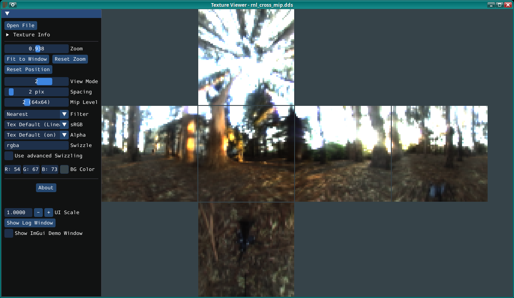

# A Texture Viewer



Still work in progress, but at already has lots of features:

You can drag the texture around the window (with left mouse button), zoom with the mousewheel
and you can press your `R` key to reset the view.  
Supports DDS, KTX and KTX2 textures *(normal 2D textures, Cubemaps and array textures containing either)*
in lots of formats *(uncompressed and compressed, as long as your OpenGL driver supports it)* and
some image file formats (JPG, 8 and 16bit PNG, BMP, TGA, PIC, PNM, HDR; GIF and PSD to some degree).  
If the texture has mipmaps, those can be viewed in several different ways.

A more unusual feature is that you can **swizzle** the color channels or even edit the pixelshader **GLSL**
code used to display the texture, which can be useful for normalmaps in optimized encodings, for example,
or to be able to view images whichs alpha-channel (for whatever reason) is `0` (just set Swizzle to `rgb1`).

Contributions are welcome, but maybe ping me first so we don't accidentally implement the same thing twice :)

Project page: https://github.com/DanielGibson/texview

Download the latest release at https://github.com/DanielGibson/texview/releases/latest

Or download Windows and Linux *test binaries* from automated builds at https://github.com/DanielGibson/texview/actions  
Downloading automated test builds REQUIRES YOU TO BE LOGGED INTO GITHUB!  
Click on an appropriate "workflow run" and then, under "Artifacts", you can download the build in a ZIP,
for example "texview-win64-120eeaa".

**Goals:**

- [x] Support at least Windows and Linux (and probably similar Unix-likes)
    - [x] maybe Mac if someone with a Mac takes care of that.
      - [x] for this I'd have to use an OpenGL core context, which may generally be a good idea
- [x] Self-contained executable using OpenGL, [Dear ImGui](https://github.com/ocornut/imgui),
      [GLFW3](https://www.glfw.org/), [Native File Dialog Extended](https://github.com/btzy/nativefiledialog-extended/),
      [libktx](https://github.com/KhronosGroup/KTX-Software/) and [stb_image.h](https://github.com/nothings/stb/blob/master/stb_image.h).  
      All statically linked (except for OpenGL, of course) and contained in this repo.
- [x] Load some common image file formats (whatever stb_image.h supports :-p) and DDS textures
      containing BC1-7 or ASTC or uncompressed data
    - [x] Support more (esp. uncompressed) formats in DDS textures
    - [x] Maybe also KTX and KTX2
    - [ ] maybe obscure formats from games like Quake2
- [x] Show some basic info (format, encoding, size, ...)
- [ ] Implement filters for filepicker so it only shows supported formats
- [x] Support selecting mipmap level for display
- [ ] Show errors/warnings with ImGui instead of only printing to stderr
- [x] Zooming in/out, dragging the texture around the window
- [x] Support selecting linear and nearest filtering
- [x] Support showing all mipmap levels at once
    - [x] in a spiral-ish compact form, in a column, in a row
    - [x] at their relative sizes OR all in the same size (there the spiral probably should be a grid)
- [ ] Similar options for texture arrays (show all array elements in column/row/grid)
- [x] Support tiled view
    - [ ] including with different mipmap levels next to each other to see how the transitions line up
    - [ ] ideally also a perspective view with a big plane going towards infinity to see the texture's
          mipmapping (with different anisotropic filtering levels) in action
- [x] Let user set swizzling of color channels (and maybe swizzle automatically for known swizzled formats like "RXGB" DXT5)
    - need to use shaders for this.. but that's also needed for texture arrays
- [ ] Maybe different texture files next to each other (for example to compare quality of encoders)
- [ ] List of textures in current directory to easily select another one
    - [ ] If one can also navigate to `..` and subdirectories here, it could even be a full alternative to the filepicker
    - [ ] ... and it could be used to navigate archives like ZIP (that are currently not supported at all).  
          But that's more in the "maybe at some point" category
- [ ] Support more than just 2D textures
    - [x] cubemaps
    - [x] texture arrays
    - [ ] 1D textures
    - [ ] 3D textures?
- [ ] Support [decoding compressed formats in software](https://github.com/DanielGibson/texview/issues/1)
      so such textures can be displayed even if the GPU/driver doesn't support them (e.g. ASTC
      currently isn't shown on NVIDIA GPUs because they only support it for OpenGL ES but this tool
      uses Desktop OpenGL).
      Also relevant for macOS, because their OpenGL doesn't even support BC6/7...

**Maybe at some point:**

* Support rendering the texture on a 3D object (cube, sphere, ...) maybe with additional textures (normalmap, ...)
  and moveable light and camera
    - [x] Allow customizing shader code for that (feasible with OpenGL as it takes GLSL directly)  
      *(At least the fragmentshader GLSL code can already be modified by the user)*
* Diffing images (e.g. to show differences between source image and compressed texture)


## Building:

```
mkdir build
cd build
cmake ../src
make -j8
```

or generate a VS solution and build that, or use ninja, or whatever.

**Dependencies on Linux** (apart from a C++14 compiler, CMake and make or ninja):
* For the integrated GLFW:
    - libwayland-dev libxkbcommon-dev xorg-dev (or your distro's equivalents)
    - see also https://www.glfw.org/docs/latest/compile.html
* For the integrated "Native File Dialog Extended" library:  
  Either `libgtk-3-dev` or (when passing `-DNFD_PORTAL=ON` to cmake) `libdbus-1-dev`
    - the latter uses the `xdg-desktop-portal` protocol for the filepicker, giving you a native
      filepicker even when using KDE (instead of always using the Gtk3 one).  
      Needs `org.freedesktop.portal.FileChooser` interface version >= 3, which corresponds to
      `xdg-desktop-portal` version >= 1.7.1, **at runtime**.  
      See also https://github.com/btzy/nativefiledialog-extended/#using-xdg-desktop-portal-on-linux

On **Windows** it just needs a recent Visual Studio version (I tested VS2022, but probably >= VS2015 works).

## License:

This software is licensed under **MIT license**, but the source includes libraries that use other
licenses. See Licenses.txt for details.
